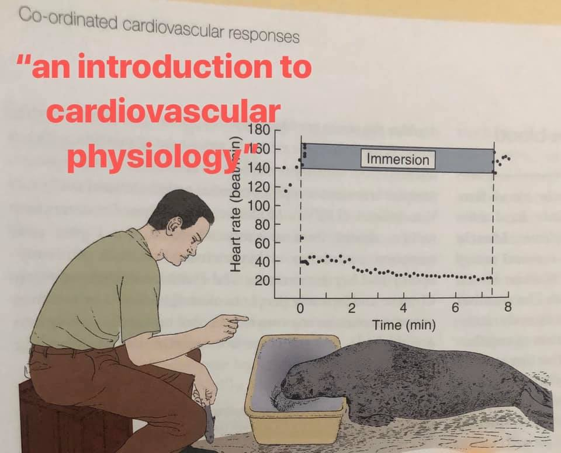
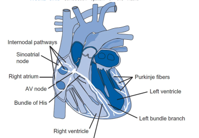
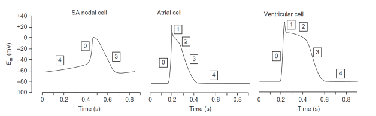
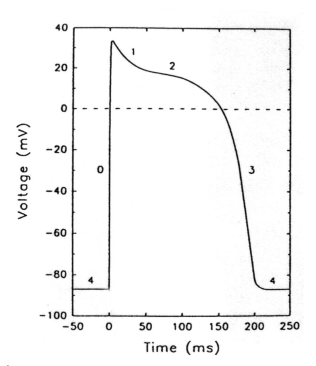
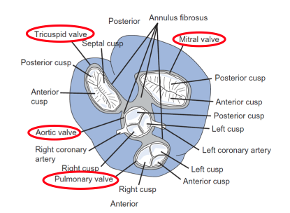
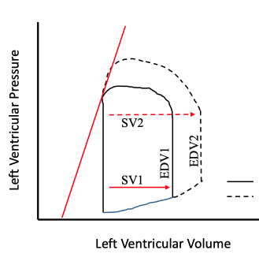
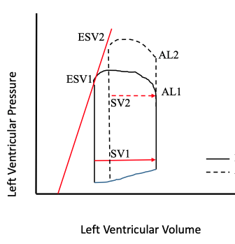
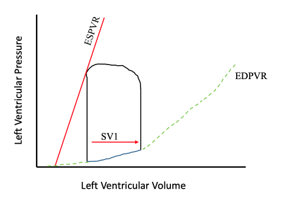
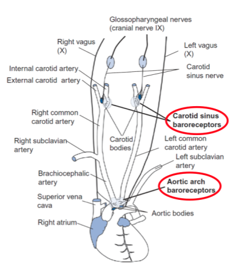

# Cardiovascular System - Biology
[Biology](Cardiovascular_System.md) | [Engineering](Cardiovascular_System_Eng.md) | [Home]

## Electrical Activity
> **Learning Objectives**
> * Cardiac anatomy
> * Different cell types - location + role
> * Initiation of heart beat and conduction through myocardium
> * Variation in AP between cells
> * Know phases and principal Ionic currents
> * Autonomic nervous system control over heart rate

### Anatomy

* Atrial and ventricle cells ~99% of mass
  * Will not contract w/o input
* Arrhythmias if unable to maintain resting membrane potential
* Cells connected by _gap junctions_
  * Between the same cell types
  * A and V - separated electrically by atrioventricular septum
* Heart muscles can not go into O2 dept - i.e. Anaerobic pathways

### Conduction

| Cells                           | Intrinsic Firing Rate |
| ------------------------------- | :-------------------: |
| Sinoatrial Node                 |       70-80 bpm       |
| Atrioventricular Node           |       40-60 bpm       |
| Bundle of His & bundle branches |        ~40 bpm        |
| Purkinje Fibres                 |       15-20 bpm       |

* Oscillating resting potential for all cells
* \<1% of heart's mass
* Conduction Velocity Determinants:
  * Size of cells - Purkinje > bundle of His and bundle branches > ventricle~atria > SA & AV
  * Number of gap junctions - same as above

| Cells                           | Conduction Velocity |
| ------------------------------- | :-----------------: |
| Sinoatrial Node                 |       ~ 4 m/s       |
| Atrioventricular Node           |       ~ 2 m/s       |
| Bundle of His & bundle branches |      ~ 0.5 m/s      |
| Purkinje Fibres                 |     ~ 0.05 m/s      |

#### Normal Rhythm - Sinus Rhythm
* SA node is the first to fire, setting rhythm
  * AP conducted through atrial cells
* Reaches AV node, slowing down to let the atria empty contents into ventricles
* AP reaches Bundle of His, speeding up, and then Purkinje fibres, even faster
  * Fast conduction ensures that all regions of ventricles contract at the same time

#### Electrocardiogram

* Convention to have same placement on the body
* P wave - atrial depolarization
* QRS wave - ventricular depolarization and atrial re-polarization
* T wave- ventricular re-polarization

* Current flow follows the positive ions
  * Inward current = positive ions entering the cell or negative ions exiting
* Diastole: relaxing - Ca2+ ~100nM
* Systole: contraction - Ca2+ ~ 1uM
* Cardiac fibres do not recruit other fibres like muscles - no tetanus

### Action Potential

* Cells have different action potentials
* AV node has similar AP to SA node -> shallower phase 4 slope
* Bundle of His + branches are similar to Ventricles
  * shallower phase 4
* Steepness of slope ~ time to reach AP threshold

#### Voltage-Gated Ion Channels in the Myocardium (6 of 20)
|              Current               |         Ion         | Relative Speed                   |
| :--------------------------------: | :-----------------: | :------------------------------- |
|           INa           |         Na+         | Fast to open and inactivate      |
|           ICa           |        Ca2+         | Slow to open and inactivate      |
| Ito (transient outward) |         K+          | Fast opening and closing         |
|           IK            |         K+          | Slow opening and closing         |
|           IK1           |         K+          | Intermediate opening and closing |
|       If (funny)        | mostly Na+, some K+ | opening rate controlled by ANS   |

> IK1 and If are opposite of the others, opening when the membrane potential hyperpolarizes

***

#### Phase 0 - Rising phase of AP
* Fast Na+ (INa) open, potential swiftly opens
* Attempts to reach Nernst Equilibrium of Sodium
  * Never reached, K+ channels (Ito) open
  * partial repolarization of membrane

#### Phase 1 - Notch
* Na+ channels are deactivated, K+ channels (Ito) open
* Partial repolarization of membrane
  
#### Phase 2 - Plateau phase
* Ca2+ channels (ICa) are open, high Ca2+ permeability
  * Membrane potential tries to reach ECa
  * Opposed by outward K+ Ito, early
  * Opposed by outward K+ IK, late

#### Phase 3 - Repolarization
* ICa inactivates
* IK open
  * Membrane rapidly hyperpolarizes
* Late, IK1 opens, complete repolarization
  * all 3 channels that are inactivated begin to close (fast Na and Ca)

#### Phase 4 - Resting Potential
* IK1 clamps the membrane potential close to EK
  * Note: Slightly permeable to Na+ so not exactly at eq'm

#### SA and AV Nodes

* Phase 0
  * No Na+ channels
  * Rising phase only from ICa
    * slower rising then working myocardium
  * Never reach ECa since IK channels activate and Ca channels deactivate
* Phase 3
  * IK channels repolarize the membrane
  * As potential becomes more negative, If activate and oppose the repolarization
* Phase 4
  * AKA diastolic depolarization
  * potential dominated by If, 
  * Slowly depolarizing until ICa activation level is reached
  * Slope determine the heart rate

 

* Working myocardium does not express If
* SA & AV cells do not express INa, Ito, or IK1
* Bundle of His and Purkinje express all

### Changing Heart Rate

#### Increasing
* Sympathetic stimulation, enervates the myocardium
* Noradrenaline and adrenaline increase the current through If and IK
  * If: slope of phase 4 increased, threshold reached earlier
  * IK: repolarization is faster in all cells

#### Decreasing
* Parasympathetic slows heart rate
* Acetylcholine, slows If and activate IK-Ach ligand gates

#### Refractory Periods

## Mechanical Activity

### Excitation-Contraction Coupling (ECC)

* DHPR: Dihydropyridine receptor - voltage-gated Ca2+ channel - L-type channel
* RyR2: type II ryanodine receptor - not coupled with voltage-gated Ca2+ channel
* NCX: Na+/Ca2+ exchanger
* SERCA2a: SR/ER Ca2+ ATPase - pumps Ca2+ back into SR
* Ca2+-induced Ca2+ release (CICR) - ligand gated channel
* Force of contraction is based on Ca2+ levels in the heart

### Heart as a Pump
* Measurement of Cardiac Output (stroke volume x bpm)
  * HR regulated by ANS
  * SV is regulated by preload, afterload and contractility
1. **Preload**: wall tension prior to contraction, stand ins - end diastolic pressure or volume
2. **Afterload**: wall tension during systole, stand in - systolic BP
3. **Contractility**: maximum force developed during systole and the rate - increased in contractility = positive inotropic effect

#### Heart Valves

> Left ventricle - Mitral Valve
> 
> Right ventricle - Tricuspid valve
>
> Aortic and pulmonary valves are also called semilunar valves (SLAP)

* Valves are passively controlled

### Cardiac Cycle

#### Wiggers Diagram

* Aorta is complaint - helps to push blood around
* Atrial kick at 'a'

#### PV Loop

* Positive Inotropic effects also have positive lusitropic effect (increase in max rate)
* Diastole still remains ~2/3 of cycle
* Integral of loop is the work done by the heart

## Regulating Cardiac Output
1. Contractility
2. Preload
3. Afterload 

### Contractility

* Achieved by changing the Ca2+ balance 
* Decreasing end systolic results in increasing **stroke volume**
* _End Systolic Pressure-Volume Relationship_ (ESPVR)
  * Straight line drawn between two points: ESV and when ventricle is full
  * Change in the slope indicates a change in contractility

### Preload: Frank Starling

* Intrinsic: Frank-Starling mechanism and force-frequency response
* Extrinsic: Bainbridge reflex, baroreceptor reflex, ANS, hormones
* Heart pumps whatever volume of blood is delivered to it (within limits)
* Homeostatic mechanism that maintains heart size
* Increases SV by increasing blood in LV
* Increases from venous constriction
  
#### Frank Starling 1
* Heart operates on ascending limb of length-tension relationship

#### Frank Starling 2
* increased affinity of TnC fro Ca2+ as length increases - stretch sensor

### Afterload

* Cardiac Output decreases
* Chronic - hypertrophy thickens walls to decrease pressure
* increases from arteriolar constriction

### End Diastolic Pressure Volume Relationship (EDPVR)

* increase indicative of:
  * chronic high afterload
  * hypertension
  * ventricular wall thickens
* Decrease:
  * Chronic volume overload
  * Heart failure
  * ventricle increases diameter

## Circulation and Blood Pressure

### Vessels
1. Artery
2. Arteriole
3. Capillaries
4. Venule
5. Vein
   

* Pulse pressure = systolic pressure - diastolic pressure
* Mean Arterial Pressure (MAP) - constant pressure to produce the same flow
  * Minimum for perfusion of the organs
  * $\text{MAP} \approx P_{Dias} + 1/3 P_{Pulse}$

#### Arterioles
* Biggest pressure drop occurs across the arterioles
* Diameter mainly controlled by ANS
  * Sympathetic constricts
  * Parasympathetic dilates
* Epithelium also release factors
* Plays the largest role in `peripheral resistance` - afterload on heart

#### Arteries
* Thick muscular walls to withstand pulsatile flow
* BP measured here
* Some even have their own arterioles and capillaries 

#### Capillaries
* Tiny - single file for RBCs
* Flow is constant, not pulsatile

#### Veins and Venous Valves
* Low pressure - non-pulsatile
* Veins have valves
  * Varicose often a result of malfunctioning valves
* Negative chest pressure helps bring up blood
* ~75% of blood is in the veins
* Sympathetic nervous system (adrenaline) constricts veins
  * Increases venous return - increasing preload
  * Shunts blood into arterial system

* _Autoregulation_: Brain and kidneys maintain constant flow despite pressure variations

### Control

* Baroreceptors control blood pressure - stretch receptors in artery walls
  * Increases in stretch increase firing rate

* Set points can ve changed by exercise and diseases
* ~120/80 Typical

[Biology](Cardiovascular_System.md) | [Engineering](Cardiovascular_System_Eng.md) | [Home]

[Home]:../../index.md