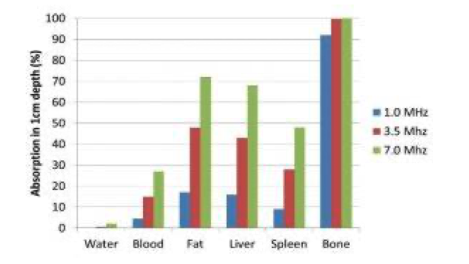
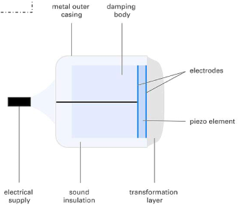
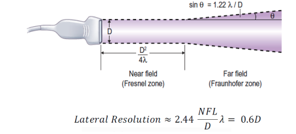
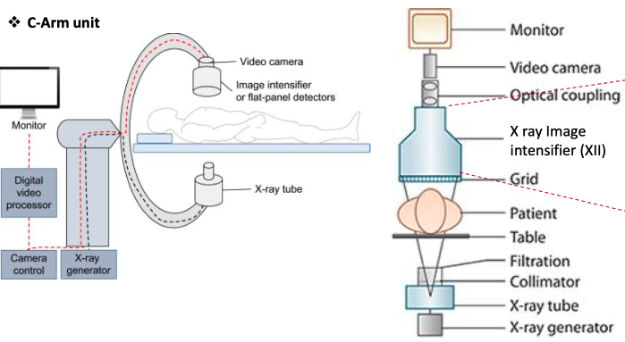
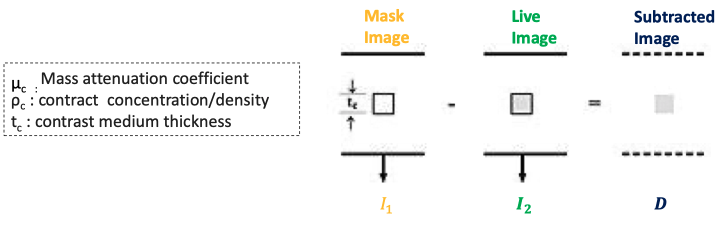

# Cardiovascular System - Engineering
[Biology](Cardiovascular_System.md) | [Engineering](Cardiovascular_System_Eng.md) | [Home]

## Diagnostic I
> __Learning Objectives__
> * Define major diagnostic techniques
> * Define ambulatory ECG monitoring types
> * Echocardiography principals
>   * ultrasound wave propagation in tissue
>   * identify ultrasound transducer components
>   * define and distinguish axial and lateral image resolution

#### Techniques
* Electrocardiography
* Echocardiography
* Cadiac Angiography
* Intravascular Ultrasound
* Nuclear heart scan
* Chest X ray
* CT scan
* MRI

### ECG
* Records electrical activity with electrodes
* Sum of all action potentials
* 12-Lead EVG
* Components:
  * Surface electrodes
  * Amplifiers - high input impedance
  * high CMRR
  * high gain
* Isolation circuit
* Filters
  * remove offset
  * bandpass filtering
* Recorder/printer

#### Ambulatory ECG monitoring
* Over an extended period of time
  * dynamic and transient caridac phenomena
  * detect arrhythmia
* Holter Monitors - external
  * Electrodes like ECG
  * Small computer
* Implanted loop recorder - internal

### Echocardiography
* Ultrasound to examine heart

#### Ultrasound
* longitudinal waves ~2 - 20 MHz
* particle movement parallel to wave propagation
  * $\lambda = \frac{C}{f}$

#### Pulse-Echo Method
* Transducer sends pulse into tissue
* Interacts with tissue
  * "Echo" is recorded
* Soft tissues: `2d/c` delay
  * Approximate spatial location of echo
  * Assuming speed of sound is constant
  * $C = \sqrt{\frac{1}{\rho K}}$

#### Tissue Interactions
* Absorption (heat)
* Scattering
* Reflection
* Refraction

* Ultrasound good when small amount is reflected
  * $R=\frac{I_r}{I_i}=(\frac{Z_2 - Z_1}{Z_1 + Z_2})^2$
* Attenuation - decrease of wave amplitude along trajectory
  * $\ln{\frac{I_x}{I_0}} = -2\alpha x$

#### Transducer
* conversion of electricity to mechanical vibrations and response back to electricity

* Piezoelectric crystals - vibrator and receiver
* Electrodes - conduct electricity to stimulate crystals
* Damping body - damps crystal vibraion quickly
* Insulation - protects from unwanted signals
* Transformation layer (matching layer) - optimizes acoustic contact

#### Production
* alternating potential difference vibrates crystal at same frequency
* Receive and transmit modes
* fr ~ thickness of crystal
  * thick crystal - low frequency

#### Resolution
* Axial resolution: along axis
  * $\text{Axial Resolution} = \frac{\text{spatial pulse length (SPL)}}{2}$
  * $SPL = \lambda \cdot \text{no. cycles}$
* Lateral resolution:
  * min distance that can be detected between two reflectors

## Diagnostic II
> __Learning Objectives__
> * Define Q factor
> * differences between ultrasound image modes
> * transducer types
> * Doppler effect

### Q Factor
* Transducer quality factor
  * $Q = \frac{f_r}{f_1 - f_2}$
  * High Q - strong resonance
  * Low Q - week resonance

#### Focusing
* Beam focusing - good
* Crystals with curved surface
* Concave lens
* Arrays of crystals

### Transducer Arrays
* grids of elements are excited to create larger images
* Linear array transducer
  * electronic focussing
  * 256 elements
* Phased array
  * delay varied to seep across FOV
  * small footprint
  * Cardiac imaging
  * makes B-scan
  

### Image Modes

#### A Modes
* amplitude mode
* measures distance
* time signal gives depth
* amplitude corresponds to impedance difference

#### B Modes
* Brightness mode
* 2-D image of reflections
* Gray-scale image from amplitudes

>__Scan Conversion__
>* polar coordinate of scan to cartesian system
>* process of converting systems: nearest neighbor, linear interpolation, bilinear interpolation

#### Image Display
* M-mode: motion mode
  * motion from wave along a chosen line
  * transducer is steady
* Measurement of arteries, ects...

### Doppler
* Based on frequency shift from motion
* S: moving scatter at velocity V, beam flow angle $\theta$
  * measures difference between two pulses sent one after the other

#### Doppler Echocardiography
* Doppler frequency: $f_d = \frac{2f_tV\cos{\theta}}{c}$
* Flow towards and away from sensor can be measured
* Signal is dependent on:
  * Blood velocity
  * Ultrasound frequency - lower ultrasound have better frequency
  * Angle of insonation - increases with alignment
* Continuos Doppler
  * Continuous signal
  * separate transmitter and receiver
  * receives all underlying velocities
  * audible sounds: high pitch, greater velocity
* Pulsed Doppler
  * range gating - can detect depth
  * signal processing to compute velocity in receive gate

## Angiography
> __Learning Objectives__
> * Describe image intensifier component
> * Define basic physics of DSA

### Fluoroscopy
* Study motion (x-ray with motion)
* Applications: catheter insertions, blood flow studies, stent placement
* Risk: same as X-Ray

### Image Intensifier
* Components:
  * Input phosphor - X ray to light photons
  * Photocathode - light photons to electrons
  * Electrostatic focusing lens/Electrodes - focalize electrons to output window
  * Anode - accelerates electrons in tube
  * Output screen/phosphor - conversion of accelerated electrons to light photons
  * Input window - Al (or Ti), keeps air out
  * Output window - thin anode

#### Performance
* Brightness Gain
  * degree to which an image is intensified of amplified 
  * $G_\text{B} = G_\text{minf}\cdot G_\text{flux}$
  * Minification gain, flux gain
    * reduction in image leads to amplification
    * $G_\text{minif} \approx \frac{\text{Area of effective input phosphor}}{\text{Area of output phosphor}}$
    * $G_\text{minif} = (\frac{D_{in}}{D_{out}})^2$

#### Limitations
* Large in size
* Require high vacuum level
* sensitive to voltage of electrostatic plate

#### Flat Pannel
* X-ray detectors based on thin film transostor
* phtodiodes
* Replace image intensifier and video camera

### Angiography
* Radioactive material injected into blood vessel
  * Visible on x-ray
* __Digital Subtraction Angiography__ (DSA): Fluoroscopy technique used in interventional radiology
* Contrast Agent
  * Max contrast for min dose - iodine based
* Diagnostic X-Ray
  * 15-150 kVm tube voltage
  * tungsten wire (200 um) cathode

#### Procedure
* Initial image taken to be removed later
* Get angiographic subtracted image
* Grey scale processing 
* Temporal frame averaging
* Edge enhancement 

#### Physics
* $D = I_1[1-\exp(-\mu_c\rho_ct_c)]$

* taking the ln of the image gives a linear relationship between thickness and density
* DSA Noise sources:
  * Quantum noise - X-ray production
  * System Noise - electronic components
* Improved SNA - $SNR \approx \rho_c\sqrt{XI}$
* Image post processing
  * Temporal averaging
  * integration - recursive filtering, temporal filtering

[Biology](Cardiovascular_System.md) | [Engineering](Cardiovascular_System_Eng.md) | [Home]

[Home]:../../index.md