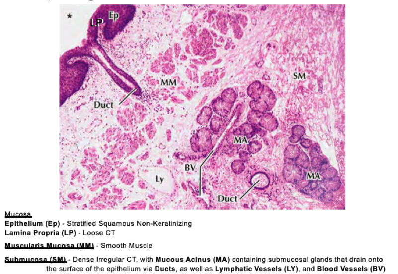
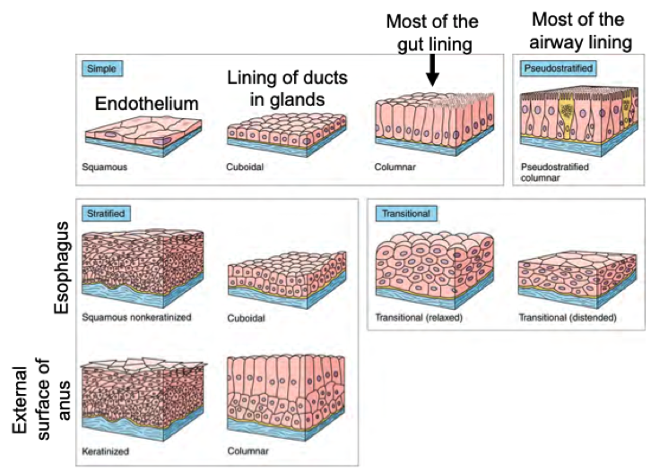
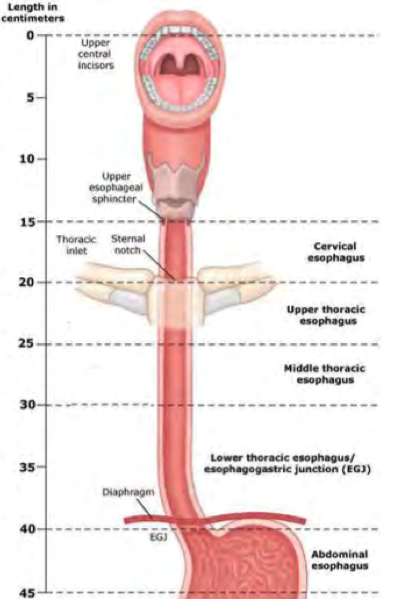
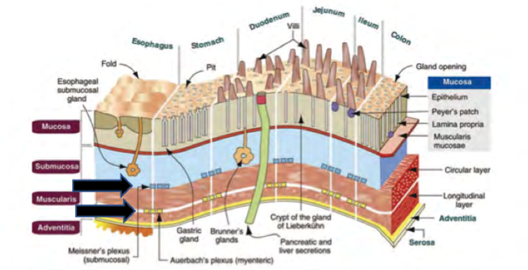
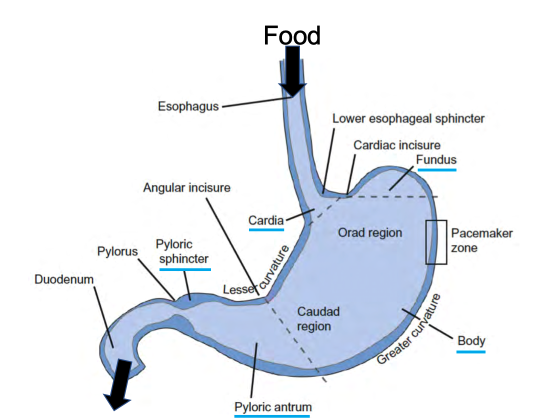
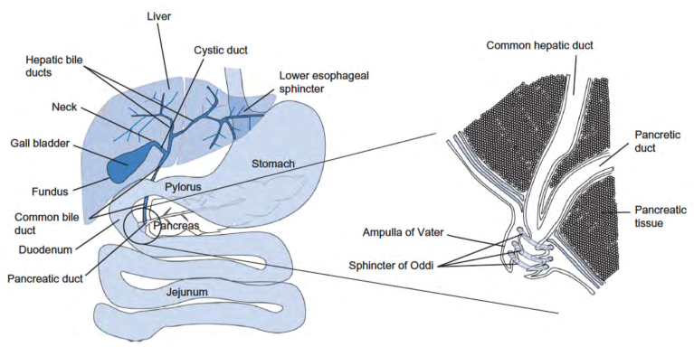
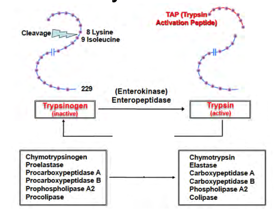

# GI Physiology - Biology

[Biology](GI_Physiology.md) | [Engineering](GI_Physiology_Eng.md) | [Home]

> __Learning Objectives__
> * Function of GI system
> * Major anatomy + three section of small intestine & six parts of large intestine
> * Purpose of chewing food
> * Sphincters of the system
> * Overall function of accessory organs (Eg. Liver)
> * Layer of GI tract and developmental origin
> * Somatic vs autonomic control
> * Anatomic location of _myenteric_ and _submucosal plexi_
> * Peristalsis
> * Epithelial subtypes an classification system
> * Describe Gastrointestinal Reflux Diseases (GERD)
> * Parts of the stomach
> * Define chyme
> * Stomach secretions and their cell of origin
> * Function of intrinsic factors
> * 3 ways intestines increase surface area
> * Major cell types in pancreas and extrahepatic bile duct system
> * 4 major classes of digestive enzymes
> * Name major enzymes of carbohydrates, proteins, lipids
> * Function of the gall bladder and bile salts
> * list proteins involved in the absorption of sugars, amino acids and lipids

## Overall Organization and Function

* Sphincters are gatekeepers for passage of nutrients through the gut

  

* General Organization from anterior to posterior of the gut tube
* Specialization occurs in the mucosal layer for the different function of the gut tube

### Epithelium

#### Gastro-Esophageal Junction
* Slight thickening of _M. Exerna_: Lower esophageal sphincter
* Stratified squamous to columnar epithelium transition

> __Barrett's Esophagus__
>* Pre-Malignant Metaplasia of lower Esophageal Epithelium
>   * Replacement of stratified squamous epithelium by columnar epithelium
>* Initiated by chronic acid reflux from stomach
>* Gastroesophageal Reflux Disease (GERD)
>* Esophageal Carcinoma

## Development
<!-- Table of developmental layers -->

| Ectoderm                                                                         | Mesoderm                                                                                                                            | Endoderm                                                                                                                               |
| -------------------------------------------------------------------------------- | ----------------------------------------------------------------------------------------------------------------------------------- | -------------------------------------------------------------------------------------------------------------------------------------- |
| <ul><li>Epithelial lining of mouth and rectum</li><li> Nervous system</li> </ul> | <ul><li>Muscular layer of stomach, intestine,ect.</li><li>Circulatory and lymphatic systems</li><li>Lining of body cavity</li></ul> | <ul><li>Epithelial lining of digestive tract</li><li>Epithelial lining of respiratory system</li><li>Liver</li><li>Pancreas</li> </ul> |

## Movement
* Coordinated by nerve bundles along the length

### Peristalsis
* The autonomic nervous system controls waves of muscular contraction
  * Generated by inner and outer muscular layers
  * Moves substances through the gut
* Each plexus innervates different portions of the gut tube

## Mouth
* Nutrients: carbohydrates, lipids, proteins, nucleic acids
* Break down begins in mouth with salivary amylase

## Stomach

* __Chyme__: a fine, dispersed mix of food and secretions

### Glands

* Oxyntic glands
  * Mucous cells
  * Chief cells - pepsinogen (pro-enzyme)and gastric lipase
  * Parietal cells - HCl and _intrinsic factor_
    * _intrinsic factor_ binds to Vit Beta-12
  * D-Cell - somatostatin
* Pylorus glands
  * Mucous cells
  * Few parietal cells
  * D-cells
  * G-cells - gastrin
  * Enterochromaffin cells - ANP

## Small Intestine
* Duodenum
* Jejunum
* Ileum
  
### Surface Area

1. Fold of Kerchkring
2. Brushes
3. Microvilli on cells

## Pancreas

* Islets of Langerhans - connected to veins and arteries
* Lobules/secretory unit - contain acinar cells 

### Acinar Cells

* Protein factories
* Serous Asini
* Large amounts of RER/Golgi
  * Zymogen granules

#### Enzymes
* Fats
  * Lipases
  * Co-lipases
  * cholesterol esterase
  * Phospholipase A2
* Starch
  * Amylase
* Protein
  * Trypsin
  * Chymotrypsin
  * Elastase
  * Carboxypeptidase A&B
* Nucleic Acids
  * Deoxyribonuclease
  * Ribonuclease
  
#### Zymogen
* Fats
  * Proco-lipase
  * Prophospholipase A2
* Protein
  * Trypsinogen
  * Chymotrypsinogen
  * Proelastase
  * Pro-carboxypeptidase A&B
* Activated outside of pancreas

* Reaction proceeds via positive feedback until all enzymes are activated
* Trypsin activated at the brush border
  * Activates other zymogens

## Food Breakdown and Absorption

### Carbohydrate Breakdown
* Amylase digests starches
* Produces mixtture of maltose, maltotriose, and limit dextrins

* Diagram shows what happens after

### Protein Breakdown

### Lipid Breakdown
* Cholecystokinin (CCK) is an important hormone
* Bile salts (Cholic acids)
  * Hydrophobic and hydrophilic face 
  

* Un-used bile salts are reabsorbed passively in small intestine
  * Actively taken up in ileum

[Biology](GI_Physiology.md) | [Engineering](GI_Physiology_Eng.md) | [Home]

[Home]:../../index.md