# Pulmonary System - Biology
[Biology](Pulmonary_System.md) | [Engineering](Pulmonary_System_Eng.md) | [Home]

## Lecture I: Process, Structure and Function

### Anatomy
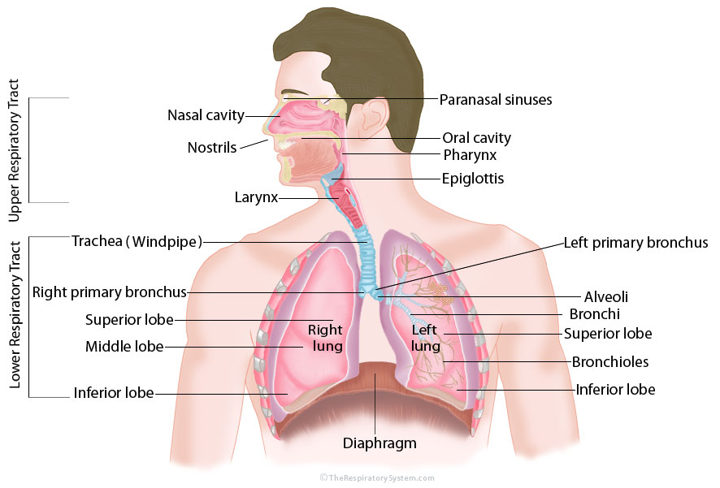
* **Respiratory Quotient**: ratio of CO2 to O2 produced (8 CO2 Molecules for every O2 molecules)

#### Upper Airways

Four Key Structures
1. **Soft Palate**
2. **tongue**
3. **hyoid apparatus**
4. **pharyngeal wall**

> **Obstructive Sellep Apnea (OSA)**
>Decrease in genioglossus muscle activity leads to obstruction of the airway by tongue

* Upper Airway Mucous lining
* Inspiration: humidifies and wars air to body conditions
* Exhalation: releases heat & moisture - partially warms & humidifies the mucous

#### Tracheobronchial Tree
* Left side - 2 lobes
* Right side - 3 lobed 
* Conducting zone - bulk flow, requires energy, contracting muscles creates pressure difference
* Respiration zone - movement by diffusion

Cartilage supports
* Trachea - U shaped cartilage, 'trachealis' smooth muscle
* Bronchi- cartilage plates interspersed within bronchial smooth muscle ring
* Others have no cartilage: Bronchiole, terminal bronchioles, respiratory bronchioles, alveolar ducts

### Airway Flow

#### Laminar flow
* silent, slow
* Hydraulic resistance $R \propto 1/r^4$

#### Turbulent Flow
* High Re #
* blunt profile
* Pressure has less direct effect on axial flow, some goes to radial flow

#### Transitional Flow
* Most of tracheobronchial tree
* Intermediate energy required

#### Airway Resistance
* Overall low
* Units of $cm\ H_2O/L/Sec$
* $\Delta P \propto \dot{V} \times R$
  * Peak flow during quiet inspiration
  * $R_{aw} = \frac{P_A-P_B}{\dot{V}} = 2 cm\ H_2O/L/sec$
  * PB - barometric/atmospheric pressure
* Resistive forces
  * Inertia
  * Friction - 80% of total resistnace
    * 60% UA
    * 40% LA
* Control
  * Parasympathetic - Acetylcholine release (vagus nerve), muscarinic cholinergic receptors, bronchoconstriction
  * Sympathetic
    * Adrenaline release - Beta2 adrenergic receptors, bronchodilation
* Health - large airways major resistance (relative cross sectional area)
* Disease - small airways, small lumen size

### Lung Volumes

* Factors determining volumes:
  * Height - taller have larger lungs
  * Gender - Males larger
  * Age - increases with age until 20 ish, elderly have increased RV and FRC
  * Ethnicity

#### Pleural Cavity

* Attach compartments, allowing lungs to grow/shrink
* Reduce friction
* Pressure at -5 cm H2O/l/sec

> __Pneumothorax__
> * Air in the pleural space
> * Collapse of lung
> * _Hemothorax_: blood in pleural space

> __Boyle's Law__
> 
> $P_1V_1 = P_2V_2$

#### Respiratory Pressures
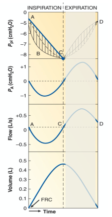
1. Inspiratory muscles contrac
2. Chest wall expands
   1. Ppl decrease by 3 cm H2O
   2. PA decrease by 1 cm H2O
3. Pressure increase in transpulmonary pressure
4. Air flows into lungs until pressure is balanced

## Lecture II: Mechanics

### Cells
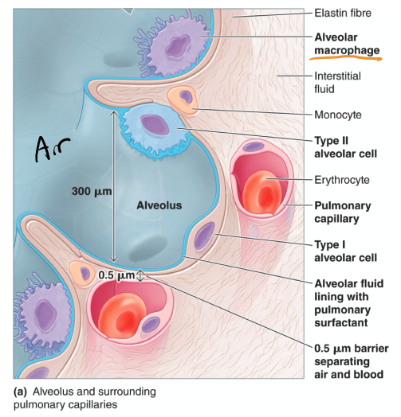

#### Alveolar Cells
* flat squamous epithilium
* 95% of alveolar surface area
* thin

#### Granular Pneumpcyte (AKA Alveolar septal cell)
* Cuboidal shape
* __lamellar inclusion bodies__ - store pulmonary surfactants, reduce alveolar surface tension
  * Sufactant is mostly lipids + some proteins
  * Diphosphatidylcholine (DPPC)

#### Alveolar Macrophage (Dust Cell)
* located on extracellular lining of alveolar surfaces
* Migratory and phagocytic

#### Alveolar-Capillary Membrane
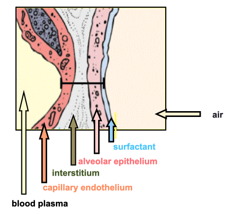
* air-blood barrier
* Alveolar interstitium
  * Joins & supports via fiber system (collagen and elastin) - contributes to compliance
  * fluid space for lymphatic system

### Lung Compliance
* Distensibility- how easily can the airways be stretched
* __Elastance__: inverse of compliance - tendency to oppose stretch
* airways are surrounded by connective tissue

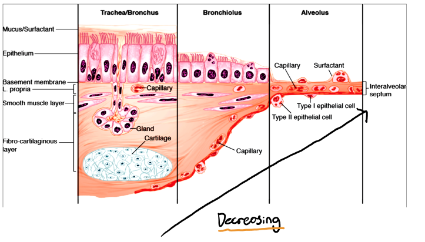

> __Emphysema__
> * disappearing lung disease
> * smoking or genetic
> * Destruction of alveolar walls - increase compliance (floppy)

> __Pulmonary Fibrosis__
> * Collagen deposition in alveolar walls
> * decreased compliance
>   * decreased lung volume (Restrictive Lung Disease)

#### Measuring Compliance
* slope of P vs V
* usually measured at FRC
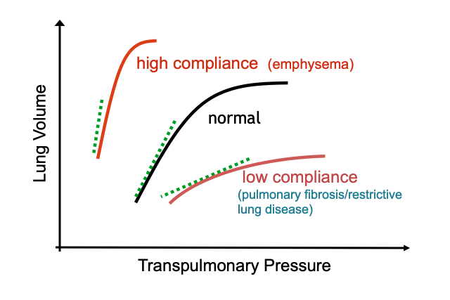

#### Alveolar Surface Tension
* determining lung compliance
* water in air creates surface tension
* creates inward recoil and alveolar collapse (atelectasis)
  * Surfactants help prevent this

> __Neonatal Respiratory Distress Syndrome (NRDS)__
> * Preme-babies with inadequate surfactant levels
> * Stiff lungs, hard to inflate
> * Ventilator dependent
> * mother treated with corticosteroids during pregnancy

### Expiratory Airflow Limitation
* Bronchoconstriction: asthma/COPD
* Inflammation: asthma/chronic bronchitis/COPD
* Excess Mucus Production: asthma/chronic bronchitis/cystic fibrosis

* Reduced Alveolar Elastic Recoil - emphysema is present, less tethering on neighboring airway, reduction of size
  * Contributes to Driving pressure for expiration
  * Patency of neighboring airways

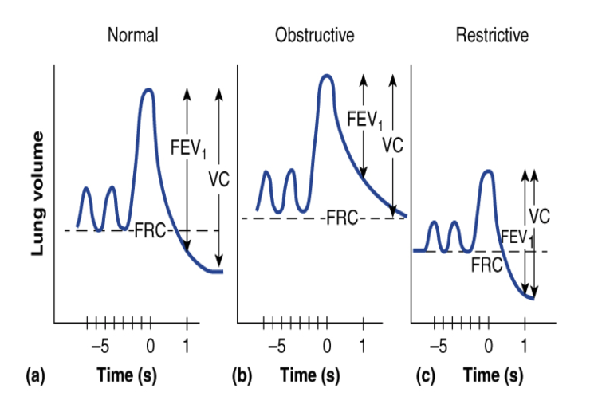

* too much pressure can block tubes
* Patency - openness 

#### Key Test - Forced Vital Capacity
* FEV1 - forced expired volume in one second
* FEV1/FEV usually ~ 80%
  * < 75-80% in diseased states

#### Conditions affecting Compliance
* Scoliosis/Kyphoscoliosis - abnormal curvature
* Ankylosing Sponylitis - gradual immobility
* Obesity
* Neuromuscular Disorders

* +ve transmural pressure - recoil inward
* -ve transmural pressure - recoil outwards
* 0, at rest

## Lecture III: Gas Exchange 

### Quantification

* Minute Ventilation ($\dot{V}_E$)
  * $\dot{V}_E = V_T \times \text{breathing frequency}$
  * VT: Tidal Volume
* Alveolar Ventilation - actual volume of air that alveoli experience
* Deadspace Ventilation - Air comes in and out

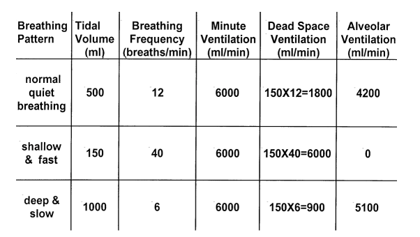

### Partial Pressure
* Partial pressure of CO2 and O2 balance between capillary and alveoli
* Air composition
  | Gas            | Percentage |
  | -------------- | ---------- |
  | Nitrogen       | 78.08%     |
  | Oxygen         | 20.94%     |
  | Argon          | 0.93%      |
  | Carbon Dioxide | 0.03%      |
* Patm ~ 760 mmHg
* $P_{gas}=P_B \times F_{I_{gas}}$

* Gasses diffuse according to partial pressure
* $\dot{V}_{GAS} \propto \frac{AD\Delta P}{T}$

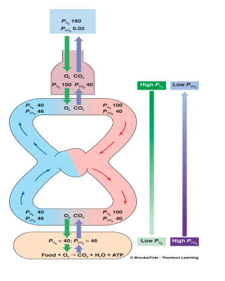

* Exercise increases Surface Area by recruiting and distension of pulmonray capillaries

### Conditions Affecting Exchange
> __Emphysema__
> * Destruction of alveolar walls
> * lung compliance increases and area for exchange goes down
> * Other reasons for loss of SA: Atelectasis, srugery

> __Pulmonary Fibrosis__
> * Collagen deposition & scar formation
> * Compliance goes down
> * Thickness for gas exchange goes up
> * Results from: asbestosis, silicosis, hay mold, antigens in avian feathers/excreta, drugs, radiation, poison

> __Pneumonia__
> * Accumulation of inflammatory pus in alveoli
> * Increases thickness

> __Pulmonary Edema__
> * abnormal fluid build up in interstitial space
> * result of damage or heart failure (left)

#### Pulmonary Transit Time

* Time is 1/4 of a second
* Body has 3/4 of a second to complete process

## Control of Breathing

### Automatic Versus Voluntary Breathing
* breathing is initiated by medulla
* modified bu higher structures in CNS

#### Automatic
* Dorsal Respiratory Group (DRG)
  * inspiratory neurons
  * receives input from mechanoreceptors and chemoreceptors
* Ventral Respiratory Group (VRG)
  * Expiratory neurons
  * silent during quiet breathing
  * active during expiration driving muscles
* **Pons** refines rhythms
  * Pneumotaxic Centre - stops inspiration, allows expiration
  * Apneustic Centre - apneusis (deep gasping breaths)

#### Bulbospinal Inspiratory Neurons
* initiates inspiration via spinal nerves to the inspiratory muscles
* __Phrenic Nerve__ C3-C5 - keep diaphragm alive
  * Bilateral nerves (both sides of brain)
* __Intercostal Nerves__ control abdomen for breathing
* __Cranial Nerves__ motor output for dilation of UAW

### Mechanoreceptors
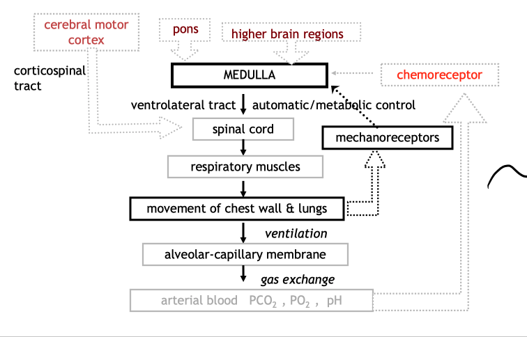
* Negative Feedback loop

> __Hering Breuer Refelx__
> * reflex to prevent over inflation of lungs
> * stretch receptors in airways respond to stretching
>   * Transmit through Vagus Nerve
> * Key role in establishing depth and rate of breathing

### Chemoreceptors
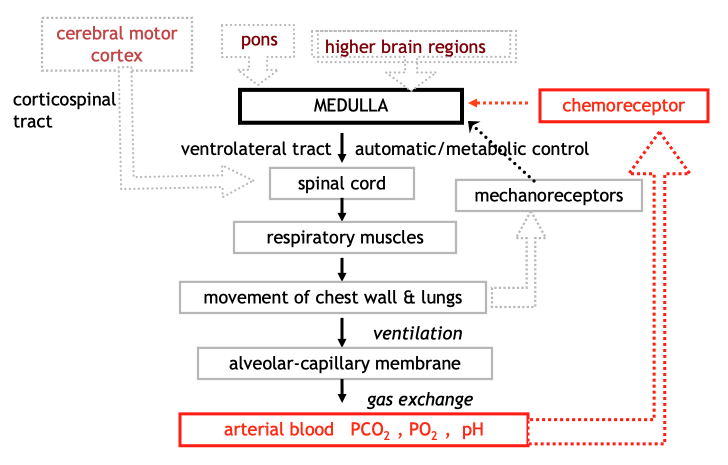

#### Central Chemoreceptors

* few mm below ventral surface of medulla
* Stimulated by protons changes (pCO2) in brain extracellular fluid
  * 35-45 mmHg

#### Peripheral Chemoreceptors

* Cartoid Bodies - at biphurcation of cartoid arteries
  * _glossophrayngial nerve_
* Aortic Bodies - at aortic arch
  * _Vagus nerve_
* Role:
  * Detect accumulation of lactic acid
  * Exercise or diabetic ketoacidosis `Kussmaul breathing`
  * Response - hyperventilation
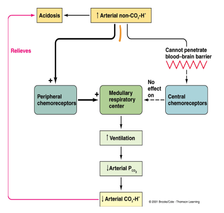

> __Congenital Central Hypoventialtion Syndrome__
> * "Ondine's Curse" - forgetting to breath
> * Breathing is fine during day - voluntary
> * Autonomic breathing is no good
> * Treatment: mechanical ventilation/Diaphragm Pacing

## Transport of Blood Gases

[Biology](Pulmonary_System.md) | [Engineering](Pulmonary_System_Eng.md) | [Home]

[Home]:../../index.md