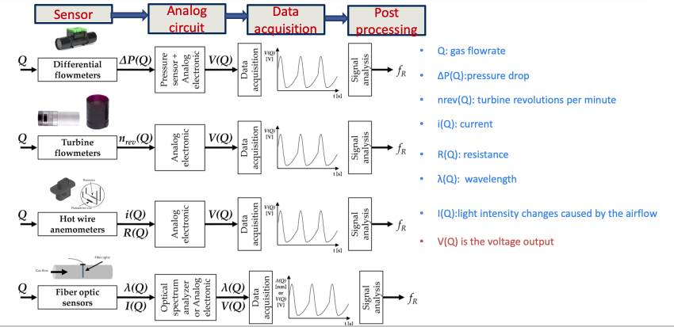
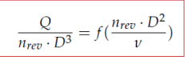

# Pulmonary System - Engineering
[Biology](Pulmonary_System.md) | [Engineering](Pulmonary_System_Eng.md) | [Home]

## Spirometry
> __Learning Objectives__
> * Importance of respiratory rate monitoring
> * Spirometer function
> * Two major spirometer types
> * principles used by flow sensing spirometer

* Respiratory monitoring
  * Monitor respiratory frequency
  * Clinical Needs
    * Key vital sings
    * Diagnosis of diseases ie sleep apnea
  * Sports Needs
    * exercise-induced dyspnea
    * exercise tolerance of patients with chronic obstructive pulmonary disease

#### Water-Seal Spirometer

* Bell moves up and down with breaths
* Potentiometer produces analog DC voltage signal proportional to displacement
* Strip-chart recorder

#### Dry-Seal Spirometer
* lightweight plastic bell
* Same but smaller and with air instead of water

### Flow Meters
* Flow sensing spirometer
* Volume can be achieved by integrating flow signal
* fR
  * Slow <12 bpm
  * Quiet 12 - 20 bpm
  * Fast > 20 bpm

#### Differential Flow Meters
* separate channel measures a pressure drop
  * Corresponds with flow
1. Pnuemotachographs
   * Fleisch, resistance in capillary tubes
   * Lilly, resistance fine wire mesh
   * $\Delta P = \frac{8\mu L}{n \pi r^4} \cdot Q$
2. Orifice
   * Channel were opening opens more when there is a higher flow rate
   * input-output relationship
   * $Q_i = \frac{d^2}{\sqrt{1-\beta^4}}\frac{\sqrt{2\Delta P}}{\rho}$

#### Turbine Flow Meter
* turbine with flat blades
* Sensor not affected by humidity
* Convert rotation of plate to electrical signal
  

#### Hot wire Anemometer
* Cooling effect of gas flow
* measure power needed to maintain temperature of wire
* $i^2 \cdot R_W = h \cdot S(T_W - T_g)$
* Wires are tiny ~10 nm
* Good for low Q applications

#### Fibre-Optic based Flow Meter
* flow effects the light
* Good for harsh conditions

## System Modelling
> __Learning Objectives__
> * Define types of mathmatical models
> * Describe linear models - identify components

### Mathematical Modeling
* Lumped
  * dependent variable is time
  * ODEs
  * series of "beads" connected by massless string
* Distributed
  * Time and space
  * PDEs
  * Heterogenous state throughout system

### Linear Model
* Air flow - turbulent, laminar, diffusion
  * Non-linear system

* Mechanical System
  * Resistive - Airways
  * Elastic - lungs + chest wall
  * $P_{res} + P_{elas} = RQ + \frac{volume}{compliance}$

### Lumped Linear Model

## Ventilators
* assist with spontaneous breathing
* Considerations
  * Backup power supply
  * safety valves

### Negative Pressure Ventilator
* iron lungs, cuirass ventilation
* creates negative thoracic pressure
* pulls on chest
  
### Positive Pressure Ventilator
* Tubes to push air into lungs
* passive expiration
* Volume cycled ventilators
  * preset tidal volume
  * Most common for aduklts
* Pressured cycled ventilators
  * stops when desired pressure is reached
* Time cycled ventilators
  * Pediactrics

### Mechanical Ventilation
* Invasive, tube down trachea
* Non-invasive, face mask
* Mechanical dead space, air not used because of mechanical ventilation

* Pneumatic circuit
  * Internal - direct flow using valves
  * External (Patient) - flow to patient

### Respiratory Air Flow
* Pneumatic
  * supply of gas pressure
  * least power
  * up to 200L/min
* Turbine
  * more flow
  * less gas
  * more power
* Belows
  * Reservoir stores gas mixture
  * External pressure is applied to generate flow
* Piston
* Aperture can control gas flow

#### Solenoid Valve

[Biology](Pulmonary_System.md) | [Engineering](Pulmonary_System_Eng.md) | [Home]

[Home]:../../index.md