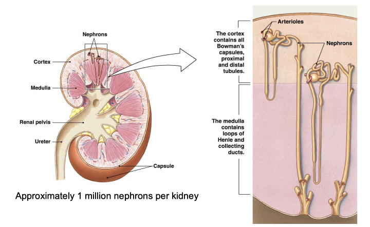
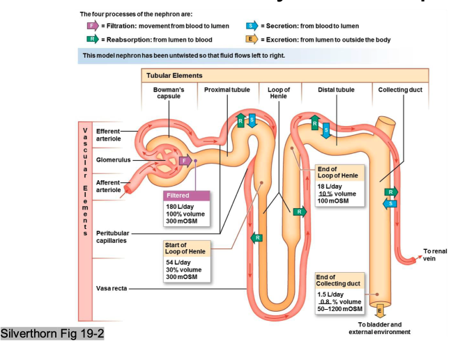
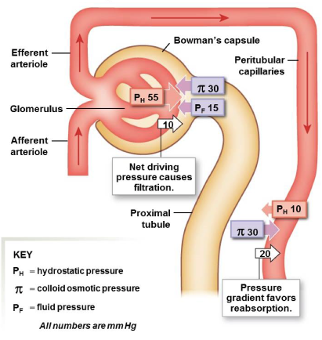
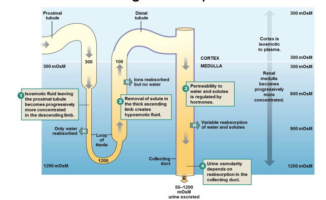
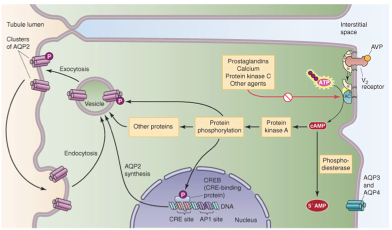
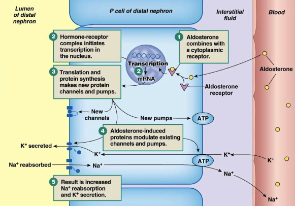
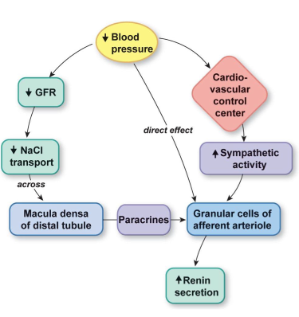

# Renal Physiology - Biology

[Biology](Renal_Physiology.md) | [Engineering](Renal_Physiology_Eng.md) | [Home]
> **Learning Objectives**
> * Describe structural organization of kidney + nephron
> * Discuss functional role of the nephron in excretion and distinguish between filtration, reabsorption, and secretion
> * Describe the barriers involved in filtration and explain how pressure components determine GFR
> * Explain how changes in vascular resistance alter GFR
> * Describe regulatory mechanisms in maintaining a stable GFR
> * Describe how Na+ contributes to reabsorption (primary and secondary active transport)
> * Describe the mechanism of AVP release and explain how AVP regulates water reabsorption in the collecting duct
> * Describe the mechanism of aldosterone release and explain how aldosterone regulates Na+ reabsorption in the distal tubule and collecting duct
> * Explain how the Renin-Angiotensin-System helps maintain blood pressure
> * Explain the mechanism of renal compensation in the maintenance of pH homeostasis

## Renal System - Overview

#### Functions of the Kidneys
* Regulation of extracellular fluid volume and blood pressure
*  Regulation of osmolarity
*  Maintenance of ion balance (Na+, K+, Cl-, Ca2+, PO43-)
* Homeostatic regulation of pH (Excretions of H+ and HCO3-)
* Excretion of waste
  * Creatine, urea, hormones, urobilinogen
* Production of hormones
  * Erythropoietin: Stimulates RBC synthesis
  * Renin: Important regulator of blood pressure

## Nephrons - The functional units of the kidney

### Anatomy

* Afferent - Admitted
* Efferent - Exiting
  

  
* __Renal Corpuscle:__ Bowman's Capsules & Glomerulus
* __Loop of Henle__: Everything between proximal and distal tubule

* Proximal convoluted tubule: thick, same with cells, lots of membrane folds
* Thin ascending limb: permeable, ø active transport
* Thick ascending limb: many mitochondria, high energy requirement, active transport of sodium

### Overview of Functions
-----

>__Fluid Movement Along the Nephron__
>
>_Fluid Fraction:_ Percent of total plasma volume filter into tubule

### Filtration
* Specific to glomerulus

__Barriers of Filtration:__

1. Glomerular capillary endothelium
2. Basal Lamina
3. Epithelium of Bowman's capsule (podocyte)

#### Main Components of Filtrate

_Filtrate_: Fluid arriving to nephron from glomerulus  
_Tubular Fluid_: fluid in tubule along the length of the nephron
* Ions: Na+, K+ Cl-, Ca2+, PO43-, H+, HCO3-, NH4+
* Water
* Urea
* Glucose
* Creatinine, urobilinogen
* Some proteins and amino acids

#### Glomerular Filtrate Rate (GFR)
* Volume of fluid filtering into Bowman's capsule `~180 L/day`
* Influenced by pressure
  * Hydrostatic pressure (PH)
  * Colloid Osmotic Pressure ($\pi$)
  * Fluid pressure within Bowman's capsule (Pfluid)
  
1. Increased resistance of __efferent arterial__
    * decreases: renal blood flow
    * increases: PH and GFR
2. Vasoconstriction of __afferent arteriole__
    * decreases: renal blood flow, PH, and GFR
    * increase: flow to other organs

#### Regulation
* Important for protection fo structural integrity of the glomerulus
  
Autoregulation:
  * Myogenic response to changes in blood pressure
    * intrinsic ability of vascular smooth muscle
    * stretch - causes vasoconstriction of afferent arterioles
      * activates cation channels on muscles
      * Depolarization results in contraction
  * Tubuloglomerular feedback - Paracrine signalling
    * Occurs at __Juxtaglomerular apparatus__ (where ascending loop of Henle passes between afferent and efferent arterioles)
    * _Macula densa_ specialized cells of ascending tubule
      * Sense increased [Na+] and [Cl-] due to high GFR
      * Release various paracrines
      * Paracrines act on afferent arteriole
      * Vasoconstriction of afferent arteriole
  
  * Near constant when blood pressure is between 80 - 180 mmHg

Extrinsic regulation
  * Hormones - Angiotensin II, Epinephrine, ects...
    * Can also act on mesangial cells and podocytes to affect filtration coefficient
  * Neural - sympathetic
    * Release norepinephrine
    * Binds to $\alpha_1$-adrenergic receptor
    * Vasoconstriction of afferent (& efferent) arterioles
      * Overall: Decreased renal blood flow & GFR

### Reabsorption
* Out of nephron, back into blood
* Occurs at __proximal tubule__
* _Transepithelial transport_: substances cross both apical and basolateral membranes of transporting epithelium
* _Paracellular pathway_: substances pass through tight junction of adjacent cells
  

#### Reabsorption is driven by Na+ Movement
1. Na+ is reabsorbed through active transport `ATP`
2. Electrochemical gradient drives anion reabsorption
3. Osmosis following solute drives water reabsorption
4. Permeable solutes are reabsorbed (Transepithelial or Paracellular)

Primary Active Transport:

* Na+ reabsorption in proximal tubule
* Na+ enters cells through membrane pores (eg: ENaC)
  * Down concentration gradient
* Pumped out of basolateral side by Na+-K+-ATPase
  * K+ Escapes through leak channel (net o movement)

Secondary Active Transport:

* Paired transport of Na+ and glucose through the SGLT protein
* Glucose leaves, diffusing through GLUT protein
* Pumped out of basolateral side by Na+-K+-ATPase
  * Amino acids, other organic metabolites and some ions use this
  

#### Reabsorption in peritubular capillaries due to lower hydrostatic pressure
> $P_H -\pi -P_{fluid} = \text{net filtration pressure}$  
> $10 -30 - 0 = -20\text{ mmHg}$
* negative pressure favours reabsorption

### Secretion
* Similar to filtration but anywhere else along capillary
* Important in homeostatic regulation (K+ & H+)
* Important for removing organic compounds from the body
  * Metabolites: Urea, NH4+, urobilinogen
  * Foreign substances: drugs
* Increasing secretion increases nephron excretion

### Excretion
`Excretion = Secretion + Filtration - Reabsorption`
* At the end of the collecting duct
* Output: Urine (variable concentration of substances)
* Useful metabolites should have been reabsorbed (Eg: Glucose, Amino Acids, ects...)

## Hormonal Regulation

#### Maintaining Water Balance
* Kidneys can _conserve or remove_ body fluid by regulating H2O

### Arginine Vasopressin (AVP)
`AKA Anti-Diuretic Hormone (ADH), Vasopressin`
* Influences H2O reabsorption
* Released by __posterior pituitary gland__
* Stimuli: High plasma osmolarity, low blood volume, low blood pressure
* Controls the addition of water pores into apical membrane of collecting ducts cells
  * Results: Increased water reabsorption & more concentrated urine
  * Dependent on amount of hormone released
* Flows across basolateral membrane through already present __aquaporin channels__

> V2: G-protein coupled receptor, phosphorylates various proteins by PKA
> * Increased AQP2 synthesis
> * Increased AQP2 expression on apical membrane

### Aldosterone
* Regulates Na+ Reabsorption
* Steroid hormone
* synthesized and released from adrenal cortex
* Acts on principal (P) cells of distal tubule & collecting duct
* Stimuli: Angiotensin II (via low blood pressure and Renin-Angiotensin-System), Hyperkalemia (high [K+])

### Renin
Low blood pressure stimulates in three ways:
1. Reduce GFR - detected by reduced Na+ at the macula densa
2. Reduce BP - detected by atrial stretch receptors and carotid & aortic baroreceptors
3. Reduce BP - detected _directly_ by afferent arterioles

* __Granular cells__ of afferent arterioles produce and secrete renin
* ANG II has other targets: cardiovascular control center (increase CO), arterioles (vasoconstrictor), hypothalamus (increases AVP), hypothalamus (induces thirst)
* Liver continuously produces and secrets angiotensinogen
* ACE - Angiotensin-converting enzyme on all vascular endothelial cells

### pH Homeostasis
1. Buffers - cellular proteins, hemoglobin, HCO3-
2. Regulation of ventilation (rate & depth)
   * Immediate
3. Kidney - regulation of H+ and HCO3- secretion/reabsorption

#### Renal Compensation
* Proximal Tubule:
    
    

* Collecting Duct Intercalated cells (IC)
  * Contain high intracellular levels of __carbonic anhydrase__
  * Type A - HCO3- generated, H+ secretion (response to acidosis)
  
    

  * Type B - HCO3- secretion (response to alkalosis)
  
    

#### Disturbances
* Acidosis (low pH)
  * Complications: Impaired protein function/denaturing, CNS depression (respiratory failure/coma)
* Alkalosis (high pH)
  * Complications: increase neuronal excitability (Seizures, tetanus)

[Biology](Renal_Physiology.md) | [Engineering](Renal_Physiology_Eng.md) | [Home]

[Home]:../../index.md